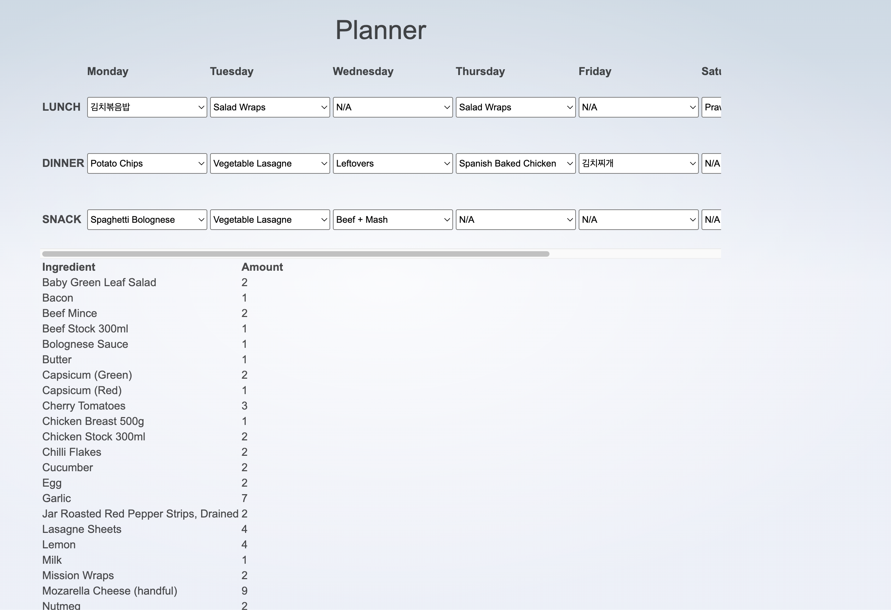

# Shopping List

A pet project to keep track of my shopping!



## Project Structure

- `/backend` contains the API server and the new shopping site
- `/frontend` contains the meal planning site.

Originally there was only the meal planning site ( written in svelte ).
A new shopping site is being built out in htmx / gotempl for a bit of fun.

A preview version of the sites are available here (these are deployed to for every commit to master):

- Meal Planning Site: http://100.49.171.244:30000/
- Shopping Site: http://100.49.171.244:30002/

## Running the project

### Prerequisites

1. Install [asdf](https://asdf-vm.com/)
2. Install tools:

```
asdf plugin add golang
asdf plugin add nodejs
asdf install
```

### Backend

To run the backend

```sh
cd backend
make serve
```

### Frontend

To run the frontend

```sh
cd frontend
npm install
npm run dev
```

## Contribution Guidelines

In order to contribute to this project you must raise your change as a pull request
to master, subject to approval, before merging in. All checks must be passing on
your change.

### Pull Requests

Pull requests should be small and focused. This makes them easier to review. 
Keep a pull request to a single commit. If you make changes
to your branch but you have already committed, stage the changes and run these commands:

```sh
git commit --amend
git push --force
```

Keep branch names short and leave all the context to the commit message.

### Commit Messages

When making commits, it's important to include a meaningful commit message
that explains *what* and *why* you are changing something. Here are some guidelines
for formatting your commit message:

- Include a subject line (less than 50 chars) stating *what* is changing.
- Use a gitmoji for the subject line to make your change more fun!
- Include a body, it should repeat the subject and add the *why* for the change.
- Wrap lines to 80 chars in the body - this makes them more readable from git tooling.
- Avoid including information about *how* something changed - leave that to the code.

Example:

```
🚚 Rename generated protobuf code
    
Rename generated protobuf code from `gen` to `genpb`
to align with the approach taken to generated sqlc code
as well as provide better clarity.
```

## Running code checks

This project uses [dagger](https://dagger.io) for CI/CD.
It can be useful to run the suite of checks locally to verify your
code before pushing up a branch.

Dagger only requires docker to be running on your machine.

```sh
asdf plugin add dagger && asdf install # only the first time

dagger checks
```

## Running the project through dagger

You can run the entire project frontend/backend through dagger if you wish to do so:

```sh
dagger up
```

## Generating code

To regenerate any generated code (protos, gotempl, sqlc), cd into the `./backend` or `./frontend` directory and run:

```sh
cd ./frontend
dagger generate

cd ./backend
dagger generate
```

## AI Agents

Skills exist for [claude code](https://claude.com/product/claude-code) and most agents
are compatible with these. Happy vibe coding!

